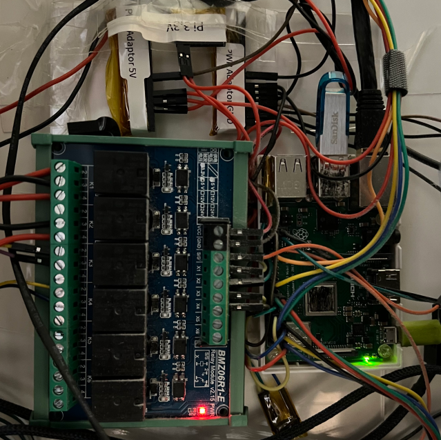
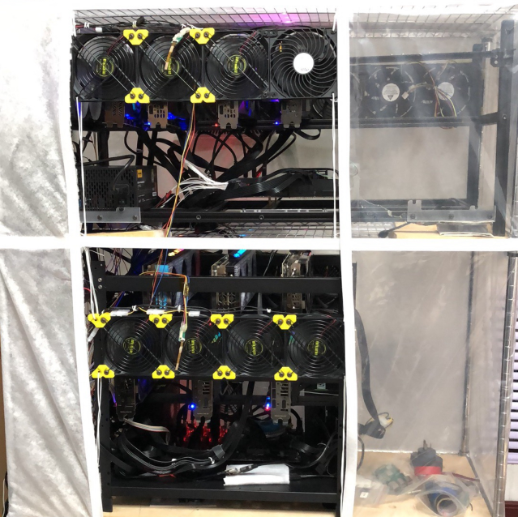
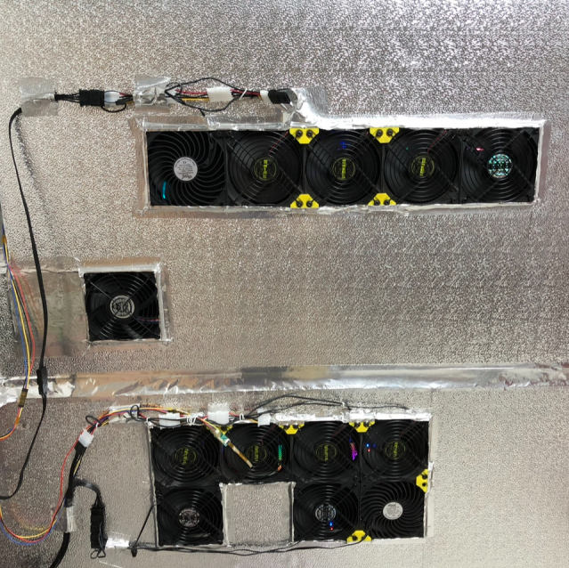

# Ethereum Mining Rig Management

This project is used to remotely control and monitor Ethererm graphics card mining machines.
Its service program can periodically check the status of different machines, sending Push Notifications
or executing predefine operations on abnormal events occurred.

The project uses a Raspberry PI board with an Ubuntu system to monitor data from sensors and those rig machines.

### features
- rig machine indicator light sensoring
- air upstream/downstream temperature sensoring
- cooling fans speed regulating
- rig graphics cards temperature monitoring
- rig graphics cards hashrate monitoring
- rig remote control ([frp](https://github.com/fatedier/frp) used)
- IFTTT Push Notification on abnormal events

### examples

